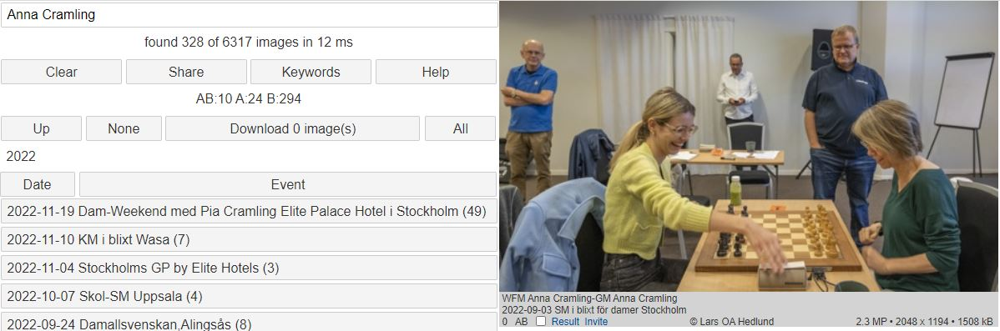

# Bildbanken 2

### Introduktion

Denna databas innehåller cirka 50.000 fotografier från den svenska schackvärlden, tagna av Lars OA Hedlund, sedan 2011.  
När du startar ser du alla bilder, med de senaste högst upp.  
Du kan avgränsa sökandet på två sätt:

1. Genom att välja katalog. Hierarkin ser ut ungefär så här:
	1. Home
	2. År
	3. Turnering/Event
	4. Klass
	5. Grupp

2. Genom att skriva in ett eller flera ord i sökrutan längst upp.  
	Skriver du flera ord, kommer bilderna högre upp ju fler träffar orden får.  
	(Man kan säga att OCH kommer före ELLER)

	* [Clear] rensar sökrutan
	* [Share] kopierar aktuell URL till klippbordet
	* [Keywords] Laddar ner en textfil med aktuell katalogs sökord samt deras frekvens
	* [Help] visar denna sida
	* [Up] går till närmast högre liggande katalog
	* [None] avmarkerar alla bilder
	* [Download] hämtar alla markerade bilder i en zipfil
	* [All] markerar alla bilder
	* Home = aktuell katalog. Här ser du alla bilder
	* [Date] sorterar på datum, fallande
	* [Event] sorterar på event, stigande
	* [2022 (4936)] visar de 4936 bilder som tagits detta år.
	* Klicka på en bild om du vill se högre upplösning. 
		* En ny flik skapas där du kan zooma (med mushjulet) och panorera
		* Bakom bilden finns tekniska data. Bland annat bländare, exponeringstid, objektiv, fotograf, tidpunkt

### Sökning

Sökning genomförs genom att fylla i sökrutan.  
Dessa ord, avgränsade av blanktecken, matchas mot texterna i kataloger och filnamn  
De kombineras automatiskt med OCH och ELLER  
Underscore (_) kan användas för att binda ihop ord, t ex Numa_Karlsson  

Sökningen är inte känslig för VERSALER och gemener.
De ord man anger kan vara delord, även enstaka tecken, och de kan stå var som helst i orden. T ex kommer "sson" att matcha ett antal Karlsson och Nilsson  

Tom söksträng innebär att alla bilder matchar.

Sökning går endast mot den katalog man valt. Välj Home om du vill söka i alla kataloger.

### Exempel

Först gjordes ett urval genom att klicka på 2022.  
Då reducerades antalet bilder till 4936.  

Därefter skrevs söktexten "Anna Cramling" in.  
Det reducerade antalet bilder till 246.  
Sökningen tog 4 millisekunder.

Bara de turneringar som gett träff på Anna eller Cramling, visas.

Kolumnnamnen [Date] och [Event] sorterar framsökta rader.

AB:9 innebär att båda orden förekom i 9 bilder.  
A:6 innebär att enbart Anna förekom i ytterligare 6 bilder.  
B:231 innebär att enbart Cramling förekom i 231 bilder (troligen Pia eller Dan Cramling).  
Notera att 9+6+231 = 246.

* 0 = första framsökta bilden
* AB innebär att båda orden förekommer i bildtexten
* Kryssrutan används vid Download
* T kan man klicka på. Då får man se turneringsresultatet
* Bilden har tagits av Lars OA Hedlund
* 2.3 MP = 2.3 miljoner pixlar
* 2048 x 1194 = bredd och höjd
* 1508 kb = bildens storlek i kilobytes

Man kan se alla 246 bilderna genom att skrolla nedåt.  
Vill man avgränsa sig kan man t ex söka på Anna_Cramling eller klicka på Schack-SM Uppsala. 

Klickar man på [Up] får man se alla år och kan då klicka på 2011 för att se hur Anna såg ut då.

Klicka på en bild för att se den i högsta upplösningen.