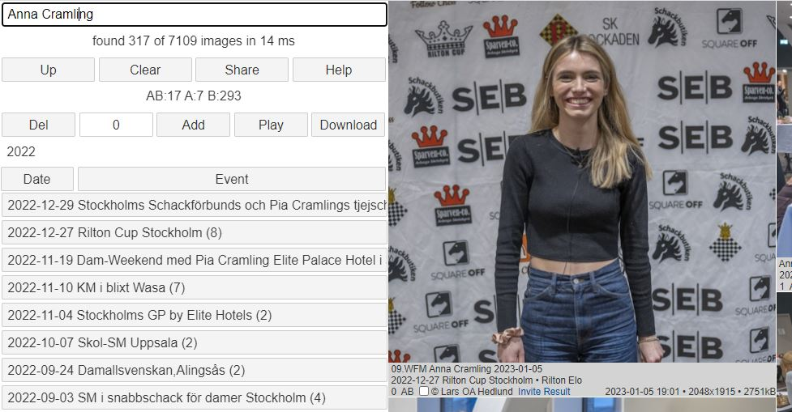

# Bildbanken 2

## Introduktion

Denna databas innehåller drygt 50.000 fotografier från den svenska schackvärlden, tagna av Lars OA Hedlund, sedan 2011.  
När du startar ser du alla bilder, med de senaste högst upp.  
Du kan avgränsa sökandet på två sätt:

1. Genom att välja folder. Hierarkin ser ut ungefär så här:
	* Home
		* År
			* Turnering/Event
				* Klass
					* Grupp

2. Genom att skriva in ett eller flera ord i sökrutan längst upp.  
	Skriver du flera ord, kommer bilderna högre upp ju fler träffar orden får.  
	(Man kan säga att **och** kommer före **eller**)

	* **Up** går till närmast högre liggande folder
	* **Clear** rensar sökrutan
	* **Share** kopierar aktuell URL till klippbordet
	* **Help** visar denna sida
	* **Del** avmarkerar alla bilder i denna utsökning
	* **Add** markerar alla bilder i denna utsökning
	* **Play** Visar ett bildspel med utsökta bilder
	* **Download** hämtar alla markerade bilder i en zipfil
	* Home = aktuell folder. Här ser du alla bilder
	* **Date** sorterar på datum, fallande
	* **Event** sorterar på event, stigande
	* **2022 (4936)** visar de 4936 bilder som tagits detta år
	* Klicka på en bild om du vill se högre upplösning

## Sökning

Sökning genomförs genom att fylla i sökrutan.  
Dessa ord, avgränsade av blanktecken, matchas mot texterna i foldrar och filnamn  
De kombineras automatiskt med **och** och **eller**  
Underscore kan användas för att binda ihop två eller flera ord, t ex *Anna_Cramling*.  
Det innebär att både *Anna* och *Cramling* måste vara med i bildtexten.

Sökningen är känslig för VERSALER och gemener.
De ord man anger kan vara delord, även enstaka tecken, och de kan stå var som helst i orden. T ex kommer "sson" att matcha ett antal Karlsson och Nilsson  

Tom söksträng innebär att alla bilder matchar.

Sökning går endast mot den folder man valt. Välj Home om du vill söka i alla foldrar.

## Visa bild
* Klicka på bilden du vill se med full upplösning
* Du kan *zooma* med mushjulet
	* Notera att den del av bilden musen står på, står still
* Du kan *panorera* genom att hasa med musen
* Bakom bilden finns tekniska data
	* T ex *bländare*, *exponeringstid*, *objektiv*, *fotograf*, *tidpunkt*
* **Share** ger dig en direktlänk till bilden, på klippbordet
	* Du kan även kopiera adressfältet (urlen)

## Download

* Ställ dig på lämplig folder
* Klicka på **Add** eller varje bild för sig
* Eventuella dubletter påverkar antalet
* Avmarkera bilderna i aktuell folder med **Del**
* Avmarkera alla bilder genom att klicka på antalet
* Ladda ner genom att klicka på **Download**
* Bilderna hamnar i en flat, zippad folder

## Download av enstaka bild

* Klicka på en bild
* Klicka på **Download**
* Bilden laddas ner som en jpg-fil med beskrivande filnamn

## Bildspel

* Markera de bilder du vill visa. Samma hantering som vid Download
* Klicka på **Play**. Ny flik skapas
* Maximera bilden med **F11**
* Pausa med **mellanslag**
* Gå framåt med **pil höger**
* Gå bakåt med **pil vänster**
* Minska hastigheten med **pil upp**
* Öka hastigheten med **pil ner**
* Avsluta genom att stänga fliken
* Maximalt 1000 bilder kan visas i Chrome eller Safari.
* Visa lågupplösta bilder med **1**
* Visa högupplösta bilder med **2**
	* [Microsoft Edge](https://www.geeksforgeeks.org/maximum-length-of-a-url-in-different-browsers/) klarar bara 60 bilder.

## Exempel

Först gjordes ett urval genom att klicka på 2022.  
Då reducerades antalet bilder till 7109.  

Därefter skrevs söktexten *Anna Cramling* in.  
Det reducerade antalet bilder till 317.  
Sökningen tog 14 millisekunder.

Bara de bilder som gett träff på *Anna* eller *Cramling*, visas.

Kolumnnamnen **Date** och **Event** sorterar framsökta foldrar.

AB:17 innebär att båda orden förekom i 17 bilder.  
A:7 innebär att enbart *Anna* förekom i ytterligare 7 bilder.  
B:293 innebär att enbart *Cramling* förekom i 293 bilder (troligen Pia eller Dan Cramling).  
Notera att 17 + 7 + 293 = 317.

* Rilton Cup Stockholm (8) innebär att åtta bilder med *Anna* och/eller *Cramling* finns i den foldern.
* Rilton Cup började spelas 2022-12-27
* 0 = första framsökta bilden
* AB innebär att båda orden förekommer i bildtexten
* Kryssrutan används vid Download eller Play
* Bilden togs av Lars OA Hedlund
* **Invite** visar Inbjudan
* **Result** visar Turneringsresultat
* Bilden togs 2023-01-05 19:01
* 2048 x 1915 = bredd och höjd
* 2751 kB = bildens storlek i kilobytes

Man kan se alla 317 bilderna genom att skrolla med mushjulet, Arrow eller Page.  
Vill man avgränsa sig kan man t ex söka på *Anna_Cramling* eller klicka på Schack-SM Uppsala. 

Klickar man på **Up** får man se alla år och kan då klicka på **2011** för att se hur Anna såg ut då.

Klicka på en bild för att se den i högsta upplösningen.

Klicka på **Add** och **Play** för att se ett bildspel.

Klicka på **Download** för att ladda ner en zipfil.  
(1 minut, 595 MB)

## Sökvarianter

* Case: Sökorden måste ha samma case som texten
* All: Sökorden kan stå var som helst i texten eller måste stå i början

[Katalogträd](https://storage.googleapis.com/bildbank2/index.html?tree=)