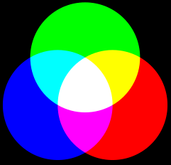

### Scrollhantering

Jag skulle vilja att bara en flik används för många bilder och en bild. Fick dock problem med att man tappar scrollpositionen efter att ha återvänt från BigPicture. Min workaround blev att visa BigPicture i eget fönster. Positiv sidoeffekt är att man kan ha flera bilder öppna i var sitt fönster.

Det som komplicerar är att infinite scroll används för framsökta bilder.

### Kommandon
```
npm run dev
npm run build
gsutil -m rsync -d -r C:\github\2022-014-Bildbanken2\public gs://bildbanken2
gsutil -m rsync -d -r C:\github\2022-014-Bildbanken2\public/build gs://bildbanken2/build
https://console.cloud.google.com/billing/01CC24-E15D8C-3CC9BD/reports;savedView=7347e53f-a528-477a-8f5d-6ea4053eb201?project=project-id-9963945262588989747
https://storage.googleapis.com/bildbanken2/index.html

Forwarding:
https://domains.google.com/registrar/bildbanken.net/webhost?utm_campaign=email_verification_first&utm_content=link_ctabtn_verify_email&utm_medium=email&utm_source=email
```

### Info-knappen

Då man klickar eller scrollar läses information in om den stora bilden (*EXIF-data*)

Filen **src\json\bilder.json** 
```json
{
	"2022": {
		"2022-09-17_Kristallens_JGP": {
		"Klass_AB_T10368": {
				"1.FM_Edvin_Trost_Klass_A_2022-09-17-X.jpg":[475,267,224639,1600,1200,"1305971bf08c855a278d25d47f3ec04d","2023-01-25 12:34:56"],
				...
			}
		}
	}
}

Home och small är platta kataloger bestående av md5.jpg-filer.

pixlar,pixlar,bytes, pixlar,pixlar,hex
[475,  267,   224639,1600,  1200, "0123456789abcdef0123456789abcdef","2023-01-25 12:34:56"]
[sw,   sh,    bs,    bw,    bh,    md5,                               timestamp]    s/b = small/big   s/w/h = size/width/height
```
* sw och sh används för att bygga swimlanes
* bs är ren information
* bw och bh används för att placera ut stora bilder initialt maximerade.
* md5 används för att hitta bildfilerna.
* timestamp anger när bilden togs.
 
* Dessa skulle alternativt kunna tas fram genom att läsa från filsystemet, men det skulle ta längre tid.
* Ponera att 47.000 thumbnails sökts fram och man vill placera dem i rätt swimlane, beroende på bildernas höjder.

### Fliknamn

Dessa visar filens namn. Tyvärr innehåller filnamnen redundans och denna står först och därmed blir fliknamnen ganska ointressanta.
```
Vy-Damallsvenskan_Julia_Östensson_2022-09-24-X.jpg [filnamnet]
Vy-Damallsvenskan_Ju [är]
Julia_Östensson.jpg  [bör]
```

### Annorlunda hantering av swimlanes

Dessa borde flyttas söderut, beroende på tidigare divars height.
Utan behov av omräkning av koordinaterna, eftersom de räknas från parents origo.

```c
<div class="container" style = "left:0px; border: solid green 1px">
	<div class="item" style="top:20px" >Pelle</div>
	<div class="item" style="top:40px" >Quintus</div>
</div>

<div class="container" style = "left:60px; border: solid red 1px">
	<div class="item" style="top:20px" >Rudolf</div>
	<div class="item" style="top:40px" >Sigurd</div>
</div>

<style>
	.container {
		position:absolute;
	}
	.item {
 		border: solid black 2px;
		position:absolute;
	}
</style>
```

### Använda html element (substantiv)
För att underlätta anpassning till mobiler och paddor, begränsas antalet olika element:
* div (generell nod)
* img (bilder)
* span (texter på samma rad)
* button
* input (text)
* input (checkbox)

## Händelser (verb)
* click
* mousedown
* mousemove
* mouseup
* scroll
* wheel
* resize

## Egenskaper (adjektiv)
* width,height,left,top
* position
* margin
* padding
* font-size
* max-height
* text-align
* padding-top
* white-space:nowrap
* overflow:hidden
* background-color
* display
* flex

### Tvingades placera knapparna för search och download med position:absolute.

Browsern har ett gap mellan knapparna som ej kan förklaras.
Känns som att en vit rand utanför knappen ingår.
Knappar med 25%+50%+25% fick ej plats på 100%.

### Deploy till Google Storage

* Skapa projektet benämnt t ex Bildbanken2
* Installera gsutil.
* Kopiera över hela projektet med kommandot:
```
gsutil -m rsync -d -r C:\github\2022-011-Bildbanken-svelte\public gs://bildbanken2
```
* -m innebär att flera processer arbetar.
* -d "Delete extra files under dst_url not found under src_url. By default extra files are not deleted."
* -r innebär rekursiv traversering av katalogerna.

* https://cloud.google.com/storage/docs/gsutil/commands/acl?hl=en

Prestanda: 2.4GB tog fem minuter. Nästa synk tog 13 sekunder. Nollsynk växer dock linjärt med antalet filer.

Skapa rättigheter för alla användare i [Google Cloud Storage](https://cloud.google.com/) :
* Edit Access
* +Add Principal
* Skriv in "allUsers"
* Skriv in "Storage Object Viewer"
* Save
* Allow Public Access

* Därefter kan man efter någon minut se access ändrad till "Public to Internet".
* Då kan man välja filen index.html och klicka på "Copy URL"
* Denna ska då vara "https://storage.googleapis.com/bildbanken2/index.html"

Kostnad: 100GB kostar $24 per år.

## Externa filer och URL:er

Dessa kan göras tillgängliga genom att dekorera .jpg-filnamnet med följande nummer:
* M = Medlemsnummer. https://member.schack.se/ViewPlayerRatingDiagram?memberid=585772
* T = Turneringsnummer. https://member.schack.se/ShowTournamentServlet?id=10370
* V = Videonummer i Vimeo. https://player.vimeo.com/video/724273589
* F = Övriga filer och url:er. Tex .pdf.

Gemensamt för dessa filer är att endast .jpg-filens path är sökbar. Innehållet är ej sökbart.

### Exempel

07.Numa_Karlsson_M585772_V724273589_F10000.jpg

För att F-nummer ska fungera måste filnamnet/urlen registreras i filen public/json/file_index.txt
(Orsaken till detta är att man inte kan ha ett filnamn eller en url i ett filnamn, däremot går ett heltal bra)

Här visas hur samma pdf kan hanteras på två olika sätt:
file_index.txt:
```c
10000 : "https://www.wasask.se/Stockholms Schackförbunds nybörjarkurs i schack.pdf",
10001 : "files/Stockholms Schackförbunds nybörjarkurs i schack.pdf",
```

Om det handlar om en fil, så måste den även placeras i katalogen public/files.

.jpg-bilden väljer man själv. Förslagsvis tas en skärmdump av lämplig bild som representerar innehållet.
Beskrivningen av innehållet lägger man i .jpg-filnamnet och denna text blir som vanligt sökbar, tillsammans med pathen.


### Programmet bilderflat.py (ersätter bilder.py)

Detta program ser till att katalogen **small** återspeglar vad som finns i katalogen **Home**.
Man skulle kunna återskapa **small** och cachen mha **Home** i sin helhet varje gång, men detta skulle ta timmar.
Därför uppdateras kirurgiskt bara de filer som är aktuella.
Döper man om en katalog i **Home**, kommer i princip den gamla att deletas från small och den nya återskapas från scratch.
Man kan hantera detta manuellt, genom att själv byta namn på de båda katalogerna och även byta namnet i cachen, **bilder.json**

Det uppdaterar även cachen **bilder.json**

Det finns alltså tre storheter: Home, small och cachen.
Då får vi åtta möjligheter:
```
Home small cache
0    0     0     pathen saknas överallt, allt ok
0    0     1     rensa cachen
0    1     0     rensa small
0    1     1     rensa small och cachen
1    0     0     uppdatera small och cache
1    0     1     uppdatera small
1    1     0     uppdatera cachen
1    1     1     allt ok
```

* Först loopas **Home** igenom och nya filer läggs till i small och cachen.
* Sedan loopas **small** igenom för att hitta onödiga filer.
* Slutligen loopas cachen igenom för att rensa bort onödiga pather som ligger och skräpar i cachen.

### JSON

OBS: Filen ska ligga i katalogen **src**. Detta tog ett antal timmar att inse.
```
	npm install @rollup/plugin-json --save-dev
	Glöm ej ändring i rollup.config.js
	import data from "./bilder.json"
```

### Flytt av alla turneringskataloger från Bildbanken 1 (Google Drive) till Bildbanken 2 (Google Cloud Storage)

1. Zippa upp filen i rätt katalog, t ex 2022
1. Tag reda på datum för turneringen och lägg in först i katalognamnet.
	* yyyy-mm-dd turneringsnamn
1. Skapa thumbnails, små .jpg (**small**) utifrån stora .jpg (**Home**). Skapa **src\json\bilder.json**
	* Kör pythonprogrammet **python bilderflat.py**. Om filer ignoreras (står överst):
		* Flytta dem till katalogen **public\files**
		* Registrera dem i filen **src\json\file_index.json**. Öka högsta *F-nummer* med 1.
		* Skapa filen "*Beskrivning*_*F-nummer*.jpg" i lämplig katalog
			* T ex kan man ta en skärmdump av lämplig del av filen. Tänk Youtube.
1. npm run dev (kompilerar svelte-filerna samt hanterar live reload)
1. Starta localhost:8080 och kontrollera att bilderna är med.
1. npm run build (skapar bl a **build\bundle.js**, en minimal, oläslig fil med alla .js och .json-filer)
	* Det går att deploya *dev*-versionen av build, men den är ett antal gånger större än *prod*.
1. Kopiera över katalogen **public** till Googles Cloud server.
	* gsutil -m rsync -d -r C:\github\2022-011-Bildbanken-svelte\public gs://bildbanken2
		* **gsutil rsync** är många gånger snabbare än GCS websida. Oftast lägger man bara till någon procent.
		* Dessutom kan man utföra många utspridda insert,delete och updates. rsync är smart.
1. Starta https://storage.googleapis.com/bildbanken2/index.html och kontrollera att allt är med
	* Kan vara lämpligt att tömma historiken för att se senaste version. Framför allt cookies och cached files.

### Alternativ datumhantering

Man skulle kunna tänka sig ta bort yyyy och behålla -mm-dd turneringsnamn.  
Då skulle man slippa en upprepning och ändå kunna söka på yyyy-mm-dd.


För att snabba upp sökningar, skapas en fil, *bilder.json*, som innehåller katalognamn och filnamn.
Denna fil, som är en [JSON](https://en.wikipedia.org/wiki/JSON)-fil, hämtas ner till klienten.

Att krympa bilder är en långsam process, därför cachas lokala bilder.js i varje katalog *small*. 
Denna katalog innehåller *thumbnails*, [wikipedia](https://en.wikipedia.org/wiki/Thumbnail).

Pythonprogrammet bilderflat.py underhåller denna fil.

### Format

* Alla blanktecken byts mot _ (underscore)
* Första speldatum anges först i turneringens namn (yyyy-mm-dd).
* Turneringens nummer enligt member.schack.se, T10368, anges sist i katalognamnet för bilderna.
	* Klass_AB_[T10368](https://member.schack.se/ShowTournamentServlet?id=10368) Kristallens JGP/Klass AB
* Förslagsvis kan medlemsnummer (member.schack.se) användas i framtiden för att spara plats och tid.
	* Dessa skulle även ge snabb access till personlig information, typ rating och andra turneringar.
	* Exempel: M430365 och M585772 i spänd väntan på startsignalen.jpg
		* [M430365](https://member.schack.se/ViewPlayerRatingDiagram?memberid=430365) Edvin Trost
		* [M585772](https://member.schack.se/ViewPlayerRatingDiagram?memberid=585772) Numa Karlsson

```
Home
	2022
		2022-09-17_Kristallens_JGP
			Klass_AB_T10368
				1.FM_Edvin_Trost_Klass_A_2022-09-17-X.jpg
			Klass_D_T10370
					7.Numa_Karlsson_klass_D_2022-09-17.jpg
	2021
Small
	2022
		2022-09-17_Kristallens_JGP
			Klass_AB_T10368
				1.FM_Edvin_Trost_Klass_A_2022-09-17-X.jpg
					bilder.js
			Klass_D_T10370
				7.Numa_Karlsson_klass_D_2022-09-17.jpg
					bilder.js
	2021
bilder.js
```
Filer har *extension* [.jpg](https://en.wikipedia.org/wiki/JPEG) och .js, övriga är kataloger.

* Filen *bilder.json* avspeglar katalogstrukturen.
* Den är uppbyggd mha *{}*, även kallad [object](https://www.w3schools.com/js/js_objects.asp) i Javascript och [dict](https://python.fandom.com/wiki/Dictionaries) i Python.
	* En bild nås via Home["2022"]["2022-09-17_Kristallens_JGP"]["Klass_D_T10370"]["7.Numa_Karlsson_klass_D_2022-09-17.jpg"] == [432,300,256000,1600,900,md5,timestamp]
	* Texterna i klamrarna, även kallade *nycklar* eller *keys* utgör underlaget för all sökning.
* bilder.js innehåller även *width* och *height* för varje thumbnail. Höjden används för utplacering i rätt [swimlane](https://en.wikipedia.org/wiki/Swimlane), bredderna är samma för alla thumbnails. De tre sista talen i listan, står för högupplösta bildens storlek i bytes, bredd och höjd i pixlar.

### Ungefärliga filstorlekar

* Högupplöst bild: 2 Mbyte (t ex 2048x1365)
* Thumbnail: 25 kbyte (t ex 432x300) (1% av högupplöst bild)
* Söktext per bild: 75 byte (filnamn + överordnade katalognamn) (35 ppm av högupplöst bild)
* Storlek av bilder.json för 50k bilder: cirka 4 Mbyte

### Sökning

Sökning genomförs genom att fylla i sökrutan. Dessa ord, avgränsade av blanktecken, matchas mot texterna i kataloger och filnamn. De kombineras automatiskt med OCH och ELLER. Underscore, _, kan användas för att binda ihop ord, t ex Numa_Karlsson, för att slippa en mängd falska Karlsson.

Sökningen kräver att man anger rätt VERSALER och gemener, t ex ger varken "KARLSSON" eller "karlsson" någon träff, däremot "Karlsson".
De ord man anger kan vara delord, även enstaka tecken, och de kan stå var som helst i orden. T ex kommer "sson" att matcha ett antal Karlsson och Nilsson.

Tom söksträng innebär att alla bilder matchar.

Sökning går endast mot den katalog man valt. Välj Home om du vill söka i alla kataloger.

### Knappar

#### Up
Man hoppar till en katalog närmare *roten* (Home).

#### Sortering av rader
Görs med Date eller Event

#### Lista med kataloger
Dessa utgörs av 2022, 2021 osv. Man hoppar till en katalog närmare *löven* (bilderna)

#### T-nummer
För de turneringar där man angett Turneringsnummer, kan man klicka på denna länk och se resultatsidan direkt.

#### M-nummer
För de bildfiler där man angett Medlemsnummer, kan man klicka på denna länk och se personinfo direkt. T ex rating och spelade turneringar.

#### Download
De bilder man markerat laddas ner till klientens Download-katalog.

#### All
Alla bilder i aktuell folder markeras.

#### None
Alla bilder i aktuell folder avmarkeras. Vill man avmarkera alla, gå till Home först.

#### Share
Aktuell avgränsning, dvs både strukturellt och med sökord, kan hämtas på klippbordet som en [URL](https://en.wikipedia.org/wiki/URL)
Det finns två typer: 
* query + folder - länk innehållande söktext och katalog
* image - länk till en bild med full upplösning

#### Play
Markerade bilder visas i ett evigt bildspel.

### Vad innebär ABC?

* Sökningen visar bilderna med flest träffar först
* I andra hand prioriteras ord tidigt i söksträngen högre än senare ord
* T ex visar sökningen "A B" bilder i denna ordning
	* AB = Båda orden är med
	* A  = Endast första ordet, A, är med
	* B  = Endast andra ordet, B, är med
* AB:2 A:1 B:3 innebär att endast två bilder innehåller båda orden.
* Totalt har 6 bilder hittats, varav fyra med enbart A eller B.

Sökningen "A B C" visar träffarna i denna ordning:
```
ABC = Vitt
AB  = Gult
AC  = Magenta
BC  = Cyan
A   = Rött
B   = Grönt
C   = Blått
Ingen träff = Svart
```


### bilder.py

Så här uppdaterar man databasen med nya bildsamlingar.

* Skapa de kataloger som behövs. Namnge korrekt. Inga mellanslag.
* public
	* Home
		* 2022
			* 2022-09-17_Kristallens_JGP
				* Klass_AB_T12345
					* 7.Numa_Karlsson_M123456.jpg

Starta Pythonprogrammet bilder.py. Följande kommer att ske:
* small-katalogen skapas. Syskon till Home
* Thumbnails skapas och läggs i small-katalogen.
* Cache av src/json/bilder.json (med bredd och höjd för varje bild)
* Cachen finns pga att det tar cirka 100 ms att skapa en thumbnail.
* Att skapa om cachen tar drygt en timme.

Utskrift då allt är uppdaterat.  
Den ignorerade filen kan man ta bort eller flytta till "files" + registrera i "file_index.json".  
Här spelar det ingen roll om man svarar Yes eller No. Home, Small och Cache överensstämmer.
```
*** Ignored file: C:\github\2022-011-Bildbanken-svelte\public\Home\0000 Klubbar\Wasa SK\KM i blixt Wasa 2022-11-10\KM_i_blixt_för_Wasa_SK.pdf

Home:  1450 folders + 43720 files
Small: 1450 folders + 43720 files
Cache: 1450 folders + 43720 files

Update Small and Cache? (NO/Yes)
```

Utskrift efter ändring av ett katalognamn.  
Här har "Uppsala" ändrats till "Uppsala Stad" i katalogen "2022-07-02_Schack-SM Uppsala" i Home.  
En exempelfil visas, av egentliga 644.  
Uppdatera genom att skriva in 'Y' och trycka på Enter.
Observera att Home styr, Small och Cache följer.  
Pythonprogrammet ändrar aldrig i Home.  
Vill man tvinga fram en ändring i Small eller Cache, tag bort aktuella filer eller kataloger i Small.  
```
*** Ignored file: C:\github\2022-011-Bildbanken-svelte\public\Home\0000 Klubbar\Wasa SK\KM i blixt Wasa 2022-11-10\KM_i_blixt_för_Wasa_SK.pdf

Home:  1450 folders + 43720 files
Small: 1450 folders + 43720 files
Cache: 1450 folders + 43720 files

Home vs Small: missing 53 folders + 644 files
Home vs Small: surplus 53 folders + 644 files
Home vs Cache: missing 53 folders + 644 files
Home vs Cache: surplus 53 folders + 644 files

Small missing: \2022\2022-07-02_Schack-SM Uppsala Stad
Small missing: \2022\2022-07-02_Schack-SM Uppsala Stad\Diverse
Small missing: \2022\2022-07-02_Schack-SM Uppsala Stad\Diverse\Vy-Schack-SM_analysrummet_2022-07-08-X.jpg

--- suppressed circa 200 lines ---

Update Small and Cache? (NO/Yes) Y

Small: Added 53 folders and 644 files
Small: Deleted 53 folders and 644 files
Cache: Pruned 53 folders and 644 files

56.98 seconds
```

### Tidsuppskattningar.

Att söka genom texten för en bild, inklusive path + bildtext, tar cirka 4 mikrosekunder.
Att hämta en bild tar längre tid. Har man sökt fram flera tusen bilder, vill man inte att browsern ska börja ladda hem alla dessa omedelbart.
Tekniken för att hantera detta benämns *infinite scroll* och bygger på att fånga scroll-händelsen och läsa in några bilder till om bufferten börjar ta slut.
Två skärmhöjder med bilder är lagom framförhållning för att ligga lite före användaren. Infinite scroll uppfanns av Aza Raskin 2006.
Just nu läser man in fler och fler bilder. Egentligen bör man kasta bort bilder efterhand som man scrollar neråt, samt läsa in dem på nytt, då användaren scrollar uppåt. Detta är INTE genomfört.

### Bildvisaren

* Genom att klicka på en thumbnail kommer man till Bildvisaren. 
* Med denna kan man zooma in och ut i en bild, mha mushjulet.
* Även förflyttning fungerar.
* Knappar:
	* Share. Skapar en URL och lägger på klippbordet
* Data
	* Vy-Damallsvenskan Julia Östensson 2022-09-25
		* Filnamn
	* 2022 • 2022-09-24 Damallsvenskan,Alingsås T10304
		* Katalognamn
	* 3.9 MP • 2048 x 2002 • 2624 kB
		* Megapixel • Bredd • Höjd • Filstorlek i block om 1024 bytes
	* 2022-09-25 • 09:25:39
		* Datum • Tid när bilden togs
	* NIKON Z 7_2 • f/4 • 1/125 • 85 mm • ISO 3600
		* Fabrikat och Modell • Bländare • Slutartid • Brännvidd • Filmkänslighet
	* © Lars OA Hedlund
		* Fotograf


### FAQ
```
Q: Varför utnyttjas inte hela skärmen för bilderna?
A: Kontrollera att browserns Zoom är inställd på 100%
```

### Misslyckat försök att få ett mera responsivt UI.
Idag kan man uppleva en viss fördröjning när man skriver snabbt.  
Idén var att dela upp sökandet i mindre batchar, t ex 47 st a 1000 bilder.  
Efter varje batch, sätts en timeout.  
Detta för att släppa fram en tangenttryckning till sökrutan.  
Om en tangent finns, starta om sökandet.  
Finns ingen tangent, fortsätter sökandet pga timeouten.  

Ej lösta problem:
* Tar tredubbla tiden
* Missar sist inskrivna tecken
* Visar inte alla vertikala knappar.
* Det positiva: inskrivningen gick smärtfritt.

### Kopplade länkar
* M Member (member.schack.se)
* T Tournament (vanligast resultatet)
* V Video
* F File (deprecated!)
* L Link (ersätter F)
* I Invite (oftast pdf)
* R Result (oftast pdf)

### Obesvarad fråga till Google
```
I have a static web server, bildbanken2 at http://storage.googleapis.com/bildbanken2/.
I would like to point my domain name bildbanken.net at it,
using forward path.
My problem is, a slash is added last in the url.
Like index.html/
So, .css and .js can't be loaded.
I'm not sure whether the problem lies in domains.google or storage.googleapis.
I guess .htaccess is controlling this, but I can't change it.

This works: http://storage.googleapis.com/bildbanken2/index.html
Works not:  http://storage.googleapis.com/bildbanken2/index.html/
This works: http://bildbanken.net/index.html
Works not:  http://bildbanken.net/index.html/

https://serverfault.com/questions/914048/htaccess-allow-viewing-of-index-html-via-www-example-com-foo-instead-of-www-ex

.htaccess

Besvarar frågan själv:
GCS är ingen webserver. Det innebär att den har ingen aning om att index.html bör var default. Därför måste filnamnet anges.

```
<Files "">
Order allow,deny
Allow from all
</Files>

<Files "index.html">
Order allow,deny
Allow from all
</Files>
```

The last slash is NOT added by me.

bildbanken.net transforms into 
https://storage.googleapis.com/bildbanken2/
It seems the default concatenation of "index.html" does not work.
I added index.html using "Edit website configuration" using console.cloud.google.
```

### attr-hantering av Inbjudan och Resultat.

Idag konkateneras info till katalognamnen. T ex _T10234, _I10027 och _R10068 vilket gör att man hittar resultatsidan  
eller inbjudan. Avvikande länkar hanteras med file_index.json. Detta pga av att länkar inte kan innehålla länkar.  
Detta kan ersättas med ett förenklat förfarande. I varje katalog kan en fil finnas som har all info som behövs.  
Dessutom slipper man redigera katalognamn, vilket innebär att de blir stabilare över tid.  
T ex 
```
Rilton:
	attr.yaml:
		Inbjudan: https://www.rilton.se/images/pdf/Inbjudan_Rilton_Cup_2022_2023.pdf
	Cup:
		attr.yaml:
			Resultat: http://chess-results.com/tnr661619.aspx?lan=1&art=4
		*.jpg
	Elo:
		attr.yaml:
			Resultat: http://chess-results.com/tnr661620.aspx?lan=1&art=4
		*.jpg
```

Vill man även dekorera filer i attr.json, kan man göra det också:
```
Rilton:
	Elo: 
		attr.yaml:
			Resultat: http://chess-results.com/tnr661619.aspx?lan=1&art=4
			Vy-Rilton-Elo_Anna_Cramling_2022-12-28-X:
				Youtube: https://www.youtube.com/@AnnaCramling
				Member: member.schack.se...
		attr.json: 
			{
				"Resultat": "http://chess-results.com/tnr661619.aspx?lan=1&art=4",
				"Vy-Rilton-Elo_Anna_Cramling_2022-12-28-X": 
					{
						"Youtube": "https://www.youtube.com/@AnnaCramling",
						"Member": "member.schack.se..."
					}
			}
```

Använder **yaml ovan**, blir renare, men **json** går lika bra. Blir lite mer *indentering*, *krullparenteser*, *dubbelfnuttar*, *kommatecken* och *rader* bara.

### Alternativ till **npm run dev** Rekommenderas!
Denna tar 3.5 min med svelte och 7 min med sveltekit.
Den går igenom 45.000 bilder i onödan och jag vet inte hur man hindrar det. 

```
npm run build (kompilerar .svelte till .js) Tar 25 sekunder
cd public
python -m http.server
localhost:8000
```

Allt fungerar, åtminstone med svelte.  
Ska testa med sveltekit.  
Man tappar dock HMR (Hot Module Replacement).
Lyfter man ut bildkatalogerna och bilder.json tar **npm run dev** bara fem sekunder.

### Om en bild förekommer två gånger, visas den som en tom yta andra gången.

Detta beror på att listan @images, med dublett md5, används för att sätta x och y. Det innebär att de två bilderna visas i exakt samma position. Kan undvikas genom att eliminera dubletter. Låter det stå kvar tills vidare.

## Bildspelet

Det bygger på att en url med md5:orna skapas.  
md5 tar 12 tecken. Chrome klarar url:er upp till 2MB.  
Det innebär att maximum (2MB/13) = 161K bilder kan hanteras  
Den begränsning på ca 16KB jag upplevde, sitter nog i pythons hhtp.server.
GCS har ingen http-server inblandad, så begränsningen ligger inte där.
Däremot har andra browsrar begränsningar. T ex Edge klarar bara 2kB.

## Hålen vid visning i swimlanes

Dessa uppstår pga att dubletter existerar. Eftersom (x,y) lagras en gång per md5, kommer båda bilderna att få samma koordinat. 
Detta kan undvikas genom att flytta (x,y) till listan $images. Istf [md5] blir innehållet [{md5,x,y}] i listan. Index kan troligen flyttas också eller t o m tas bort eftersom det framgår av positionen i $images.
(Dessa hål visas inte längre. Varje bild har nu egna koordinater)

## 60-baserad timestamp
```
0         1         2         3         4         5      
012345678901234567890123456789012345678901234567890123456789
0123456789ABCDEFGHIJKLMNOPQRSTUVWXYabcdefghijklmnopqrstuvwxy
day       = 0..U
hour      = 0..N
minute    = 0..y
second    = 0..y

Halvdecenniet bestämmer första tecknet
1970                             0 1 2 3 4 5
2000 6 7 8 9 A B C D E F G H I J K L M N O P
2100 Q R S T U V W X Y a b c d e f g h i j k
2200 l m n o p q r s t u v w x y

Andra tecknet

		0 1 2 3 4 årtalet modulo 5
JAN 0 C O b n
FEB 1 D P c o
MAR 2 E Q d p
APR 3 F R e q
MAJ 4 G S f r
JUN 5 H T g s
JUL 6 I U h t
AUG 7 J V i u
SEP 8 K W j v
OKT 9 L X k w
NOV A M Y l x
DEC B N a m y

Exempel: 
1970 JAN = 00
2023 FEB = Ac

Största möjliga tidpunkt:

yyUNyy = 2269-12-31 23:59:59

```